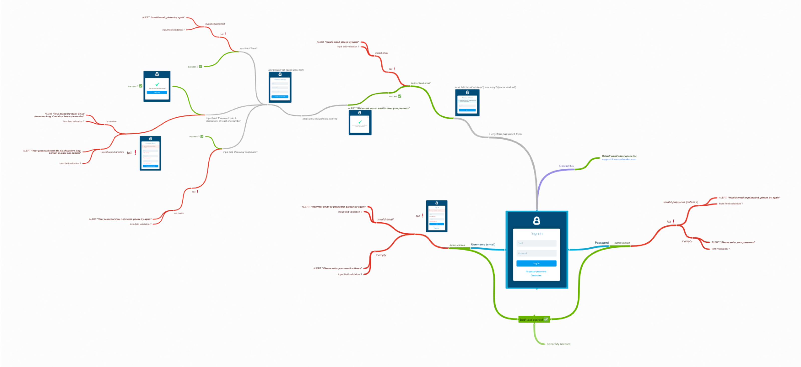
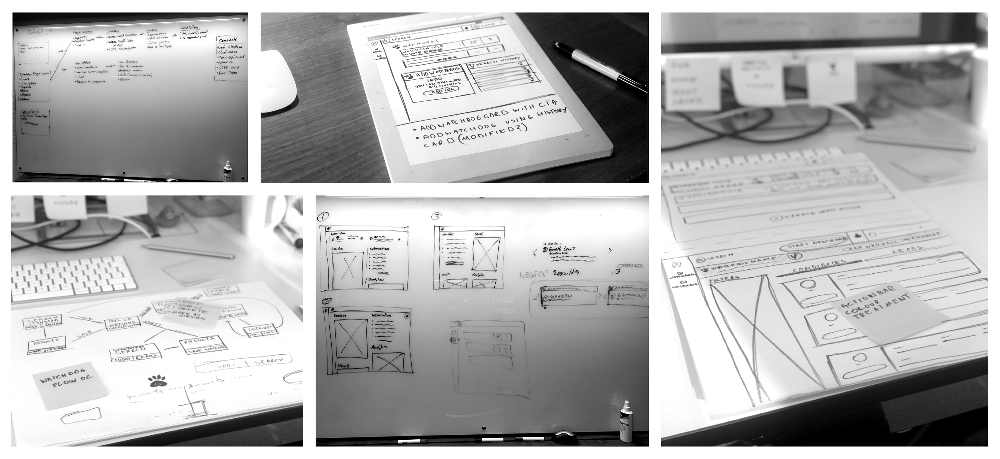
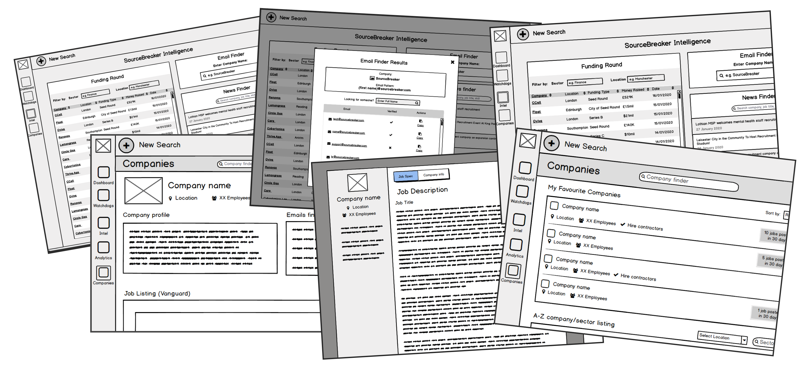

<!-- ### A wallpaper series using shapes and light by [Jean-Marc Denis](http://jmd.im/black) -->

2020 was a year of vital transformation for SourceBreaker. On January the 2nd, thousands of SourceBreaker users in the U.K, U.S, Europe, Australia, Russia and South Africa gained access to SourceBreaker 2.0. Re-branded and re-built this brand-new platform equipped users with a whole new array of improved features and additional products.

### My Role

I led the design of SourceBreaker 2.0 since the outset of the project in January 2019. Up until February 2020, I led efforts to evolve the service and address customer pain‐points related to the browse and discovery experience.

