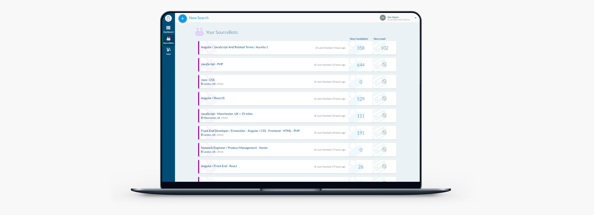
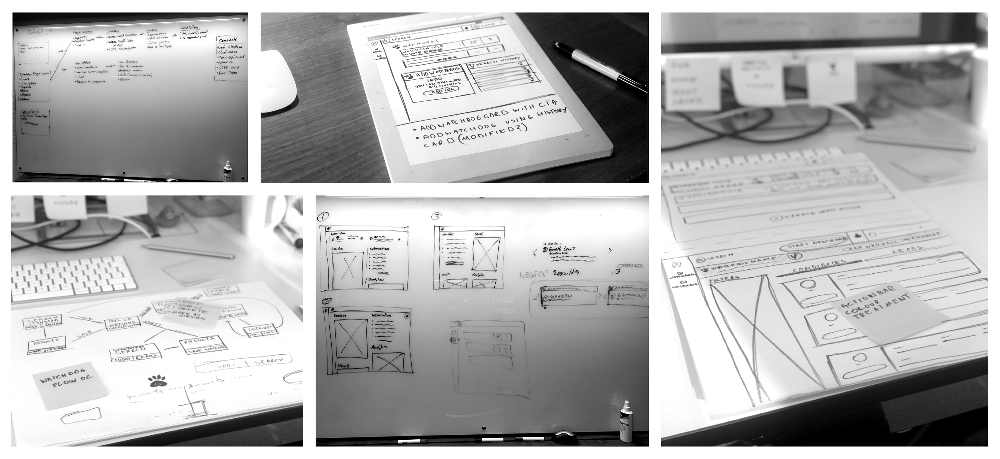
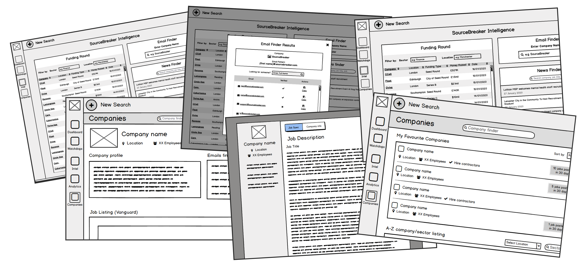

<!-- ### A wallpaper series using shapes and light by [Jean-Marc Denis](http://jmd.im/black) -->

2020 was a year of vital transformation for SourceBreaker. On January the 2nd, thousands of SourceBreaker users in the U.K, U.S, Europe, Australia, Russia and South Africa gained access to SourceBreaker 2.0. Re-branded and re-built this brand-new platform equipped users with a whole new array of improved features and additional products.

### My Role

I led the design of SourceBreaker 2.0 since the outset of the project in January 2019. Up until February 2020, I led efforts to evolve the service and address customer pain‐points related to the browse and discovery experience.

### The challenge

Fast, Cheap, Quality
Given the deadline, budget and some technical limitations required a Lean UX / UI Design approach. In the early stages of the brainstorming process and shaping up business fundamentals, I adopted a Design Sprint approach, where all stakeholders and key members of the team took part in breaking down the requirements and potential solutions. Going through user flows and prototypes feedback, I was able to evangelise customer goals and carefully balance business goals.

### Product Discovery

It was imperative at this stage to ensure and prove that the ideas born during the discovery period will be valuable and usable for the users, feasible for our engineers and are viable for the business. At this point,
I needed to test those ideas using various prototypes and prototypes.

<iframe height="300" style="width: 100%;" scrolling="no" title="Sonar button" src="https://codepen.io/Pav_Ka/embed/eQeOLb?height=187&theme-id=dark&default-tab=css,result" frameborder="no" allowtransparency="true" allowfullscreen="true">
  See the Pen <a href='https://codepen.io/Pav_Ka/pen/eQeOLb'>Sonar button</a> by Pav_Ka
  (<a href='https://codepen.io/Pav_Ka'>@Pav_Ka</a>) on <a href='https://codepen.io'>CodePen</a>.
</iframe>
 
Prototyping
A powerful collaboration tool that allows the entire team to experience the prototype to develop shared understanding.

