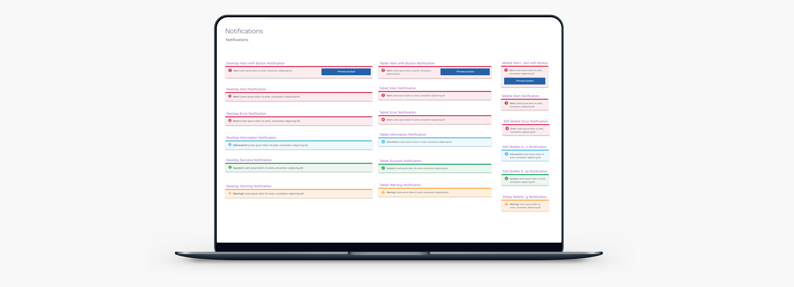
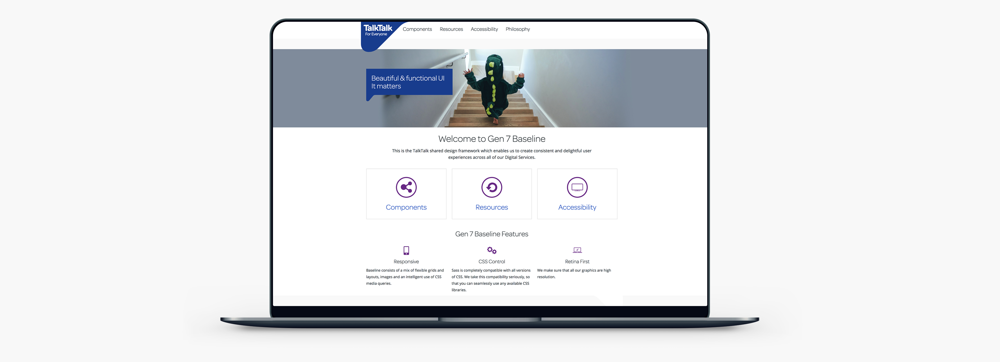
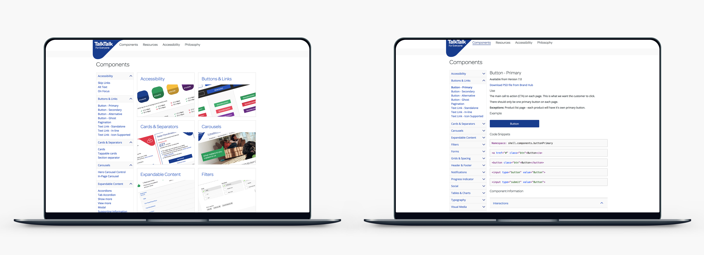
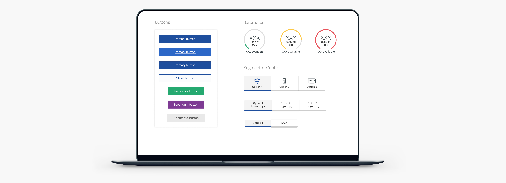

### The Problem

My journey with TalkTalk started in 2014. I was hired to re-design the Homepage, ensuring it's accessible (AA standards) and responsive.

I soon realised I needed a design system to ensure consistency across TalkTalk's entire website.

### Our approach

TalkTalk is a budget Internet Service Provider, and we knew we have to rely on frameworks to keep the budget as low as possible.

After extensive research and tests, we have decided to go with AngularJS and Bootstrap. Our vision was to treat TalkTalk's online products as independent Single Page Web Applications, supported by already established responsive framework re-styled with TalkTalk's brand guidelines in mind. We were asked to create a working prototype within a month and present it to the stakeholders.

### Prototyping

Building a responsive Single Page Web Application was an untrodden path at TalkTalk, this gave us technical and creative freedom to set principles and best practices in design and front-end implementation. We started from researching and defining UX and UI guidelines for each component we have set out to create for our prototype. This consisted of navigation, buttons, footer, general page styling, graphy and iconography. One of the requirements was to adhere to AA accessibility standards enabling screen readers and many other functionalities required for disabled users to be able to access the website.

I have created cut-outs of all the components we wanted for our prototype in all 4 breaking points. This was handy when presenting the concept to the rest of the business. This allowed better understanding by interaction. Seeing how singular components stack into larger modules and then into pages allowed all involved to imagine how this would work in practice.

### The Design and Front-end stage

I have used Sketch as my main design tool. There were many advantages for using it. Sketch integrates allot of useful plugins created by ever growing community. It had great design library integration possibilities. The files unlike Photoshop were small in size thanks to vector graphics. With integrated pattern library, I was able to amend my designs with ease and almost instantaneously across all projects. Some examples below:

The Continuous sign-off process ensured we were able to move onto another component and make sure there's no surprises or major changes later in the project.

In total, we have created 68 unique components that are used today for building pages and customer journeys at TalkTalk. This library is constantly updated and improved. Each component has its own dedicated page with UX and UI writ-up and a code snippet for developers. It allowed us to share this library with our external partners and within many branches at TalkTalk.

